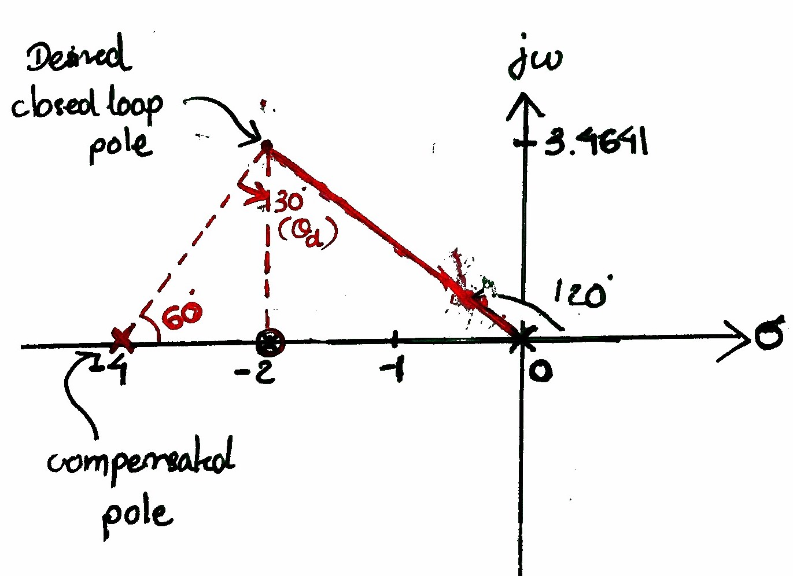

[//]: # (Image References)
[image_0]: img/img1.png
[image_1]: img/output_fig1.png
[image_2]: img/output_fig2.png
[image_3]: img/output_fig3.png
[image_4]: img/img2.png
[image_5]: img/output_fig4.png
[image_6]: img/output_fig5.png
[image_7]: img/eqn1.gif
[image_8]: img/eqn2.gif
[image_9]: img/eqn3.gif
[image_10]: img/eqn4.gif
[image_11]: img/eqn5.gif
[image_12]: img/eqn6.gif
[image_13]: img/eqn7.gif
[image_14]: img/eqn8.gif
[image_15]: img/eqn9.gif
[image_16]: img/eqn10.gif
[image_17]: img/eqn11.gif
[image_18]: img/eqn12.gif

# Control Engineering Assignment III

In this assignment, I'm going to design a system using lead compensator with the help of root locus and check the final results using Matlab.

The system I'm going to design is as follows:

![alt text][image_0]

The damping ratio of closed loop poles is *0.5* and natural undamped frequency *2 rad/sec*. It is desired to modify the closed loop poles so that natural undamped frequency becomes *4 rad/sec* **without changing the damping ratio**.

## Root Locus & Step Response

Before adding a compensator, lets check the root locus of the system and its response first. We can simply do it by using Matlab command line.

```matlab
>> s = tf('s');
>> G = 4/(s*(s+2));
>> % Plot root locus
>> rlocus(G)
```
![alt text][image_1]

```matlab
>> % closed loop transfer function (unity feedback)
>> sys0 = feedback(G,1);
>> % Plot root locus
>> rlocus(sys0)
```
![alt text][image_3]

From the closed loop poles, we can see that our system's damping ratio is *0.5* and undamped frequency of *2 rad/sec* which is the same as the given system characteristics.

```matlab
>> % Plot step response
>> step(sys0)
```
![alt text][image_2]

Our goal is to add a compensator to meet the system requirements (which are **0.5** for damping ratio and **4 rad/sec** for undamped frequency).

## Desired Closed Loop Poles

We can easily find our desired closed loop poles by using the system requirements:

<br>

![alt text][image_13]

![alt text][image_14]

<br>

Then, I'm going to draw our desired closed loop poles on the root locus and calculate the necessary angles to find the angle of deficiency.


Below are the calculations of the angle of deficiency:

![alt text][image_15]

![alt text][image_16]

![alt text][image_17]

![alt text][image_18]

<br>

## Choosing new pole and zero

If we choose the zero of the lead compensator at s = -2 so that it will cancel the plant pole at s =-2, then the compensator pole must be located at s =-4.



<br>

## Lead Compensator

Lead compensator is represented by the following transfer function:

![alt text][image_4]

So we can calculate the gain **K** by using the magnitude condition as follows:

<br>

![alt text][image_10]

![alt text][image_11]

![alt text][image_12]

<br>

Now, we get our lead compensator transfer function. Lets check again our step response of the new compensator system.

```matlab
>> original_sys = feedback(G,1);
>> % Compensator Gc
>> Gc = 4*(s+2)/(s+4);
>> % Unity feedback with compensator
>> compensated_sys = feedback(Gc*G,1);
>> % Plot step response
>> step(original_sys, compensated_sys)
```
![alt text][image_5]

We can clearly see that our new system is better than the previous uncompensated one. Now, lets check the characteristics of the response.

![alt text][image_6]

You can see that our new system has the undamped frequency of **4 rad/sec** and damping ratio of **0.5** which meets the system requirements.

## Final Design Check

The static velocity error constant for the compensated system can be calculated as:

<br>

![alt text][image_7]

![alt text][image_8]

The steady state error is then calculated as:

![alt text][image_9]

## Conclusion

There are many ways to achieve the system requirements such as adding a PID controller or others. In this system, I'll use the Lead Compensator. We can conclude that our control system design meets the system requirements by adding the lead compensator.
